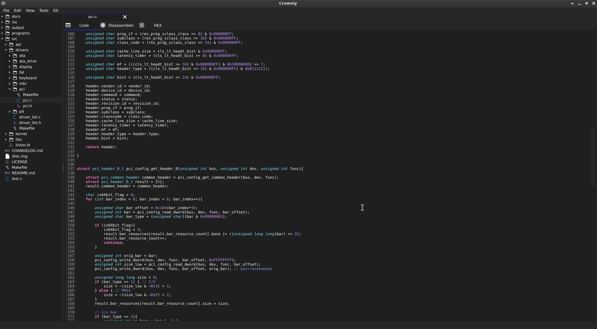
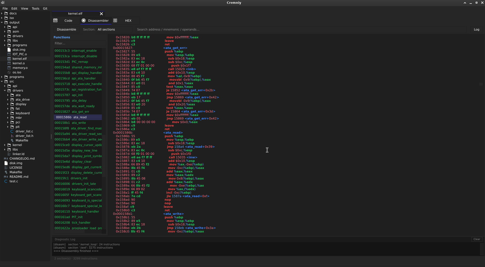
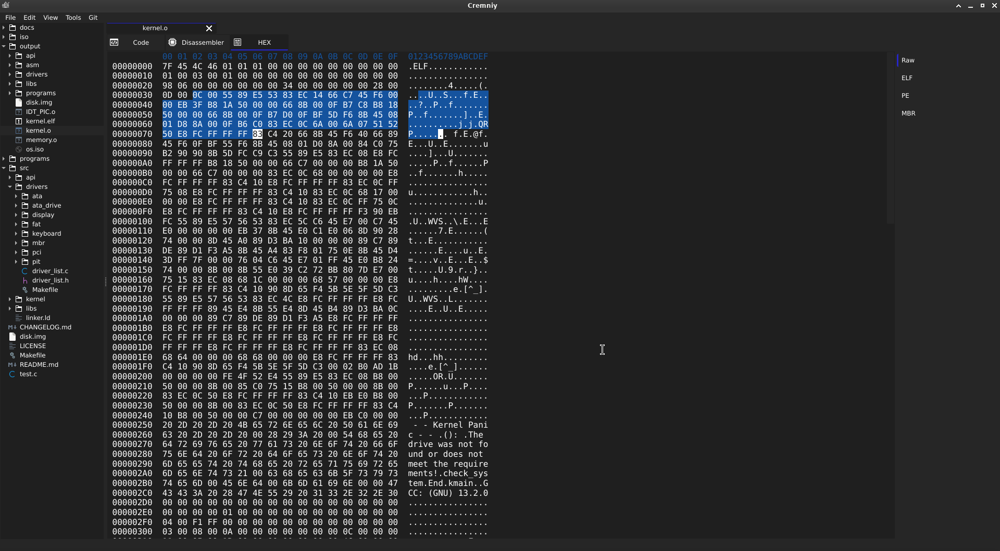
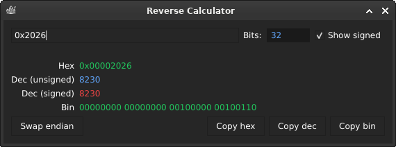

<div align="center">


<br>
<h3>Cremniy</h3>
<h6>Среда разработки для низкоуровневого программирования, объединяющая все низкоуровневые инструменты в одном приложении</h6>

[](LICENSE)
[](CONTRIBUTING.md)
[](https://t.me/cremniy_com)
<br>
[](https://en.cppreference.com/w/cpp/17)
[](https://www.qt.io/)

[English](README.md) • Русский

</div>

---

## Что такое Cremniy?

**Cremniy** — интегрированная среда для низкоуровневой разработки. Вместо того чтобы держать HEX-редактор в одном окне, дизассемблер в другом, а редактор кода в третьем — всё это объединено в одном последовательном и удобном приложении.

**Ориентирован на:**

- 🛠 Разработчиков системного ПО
- 🔍 Reverse-инженеров
- 🔐 Специалистов по информационной безопасности
- 📡 Разработчиков embedded-систем

---

## Скриншоты

<div align="center">

### Редактор кода

<br>

### Дизассемблер

<br>

### HEX-редактор

<br>

### Другое

<br>
</div>

---

## Возможности

### Доступно сейчас

| Функция | Описание |
|---|---|
| 📝 Редактор кода | Написание и редактирование низкоуровневого кода с поддержкой синтаксиса |
| 🔢 HEX-редактор | Просмотр и изменение бинарных данных на уровне байт |
| 🔧 Дизассемблер | Декодирование машинных инструкций в читаемый ассемблер |

### В планах

- 🐛 **Отладчик** — пошаговое выполнение, просмотр регистров и памяти
- 🧠 **Визуализация памяти** — наглядные карты расположения и выделения памяти

---

## Начало работы

### Зависимости

| Зависимость | Мин. версия |
|---|---|
| **CMake** | 3.16 |
| **Qt** | 6.x |
| **Компилятор C++** | Поддержка C++17 |

<details>
<summary><b>🪟 Windows</b></summary>

1. Установить [MSYS2](https://www.msys2.org/)
2. Установить MinGW, CMake, Qt6-base через **терминал MSYS2**:
```base
pacman -S --needed base-devel mingw-w64-ucrt-x86_64-toolchain mingw-w64-ucrt-x86_64-cmake mingw-w64-ucrt-x86_64-qt6-base
```
3. Добавить папку с пакетами MSYS2 в PATH  
   По умолчанию MSYS2 пакеты находятся в `C:\msys64\ucrt64\bin`

</details>

<details>
<summary><b>🐧 Linux (Ubuntu / Debian)</b></summary>

```bash
sudo apt update
sudo apt install cmake g++ qt6-base-dev
```

> [!NOTE]
> Если пакет `qt6-base-dev` недоступен в вашем дистрибутиве, используйте [официальный установщик Qt](https://www.qt.io/download-qt-installer-oss).

</details>

<details>
<summary><b>🍎 macOS</b></summary>

С помощью [Homebrew](https://brew.sh/):

```bash
brew install cmake qt@6
```

</details>

---

## Linux cборка

```bash
git clone https://github.com/igmunv/cremniy.git
cd cremniy

mkdir build && cd build
cmake ../src
cmake --build .
```

### Сборка в режиме Release

```bash
cmake ../src -DCMAKE_BUILD_TYPE=Release
cmake --build . --config Release
```

## Windows сборка

### Установить Windows [зависимости](#зависимости)

### Собрать Cremniy

```bash
git clone https://github.com/igmunv/cremniy.git
cd cremniy

mkdir build && cd build
cmake -G "MinGW Makefiles" ..\src
cmake --build .

```

### Сборка в режиме Release

```bash
cmake ..\src -DCMAKE_BUILD_TYPE=Release
cmake --build . --config Release
```

---

## Участие в разработке

Вклад в проект **приветствуется**.

Будь то исправление ошибок, новая функциональность или улучшение документации — открывайте issue или отправляйте pull request.

Все участники указываются в [ACKNOWLEDGEMENTS.md](ACKNOWLEDGEMENTS.md) и упоминаются в видео на [YouTube-канале](https://www.youtube.com/@igmunv).

Подробнее — в [CONTRIBUTING.md](CONTRIBUTING.md).

---

## Лицензия

Распространяется на условиях, описанных в [LICENSE](LICENSE).
